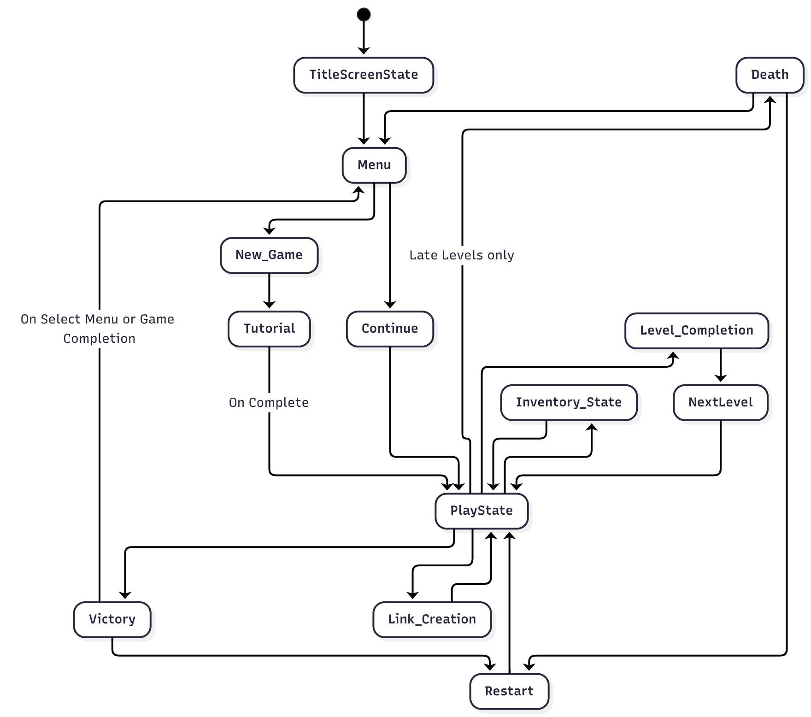
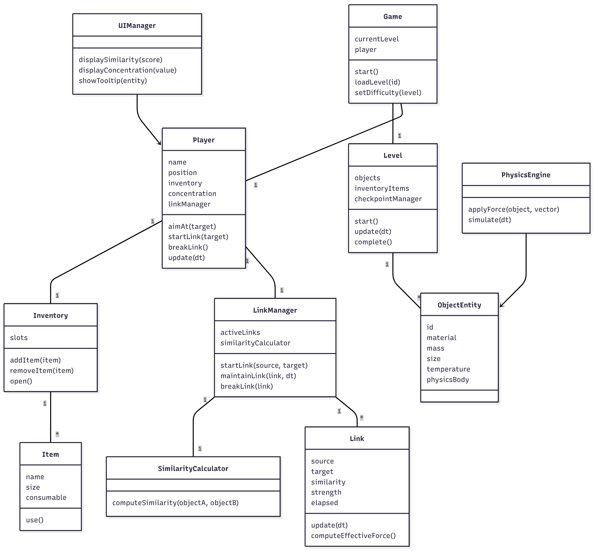
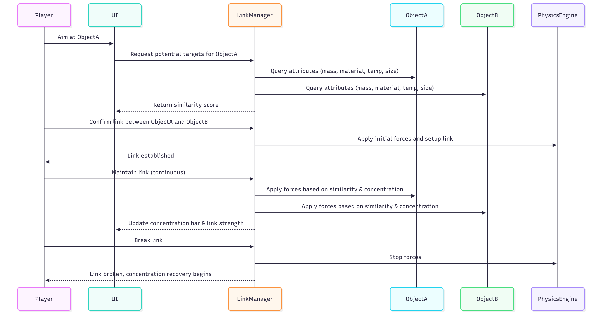

# Final Project

-   [ ] Read the [project requirements](https://vikramsinghmtl.github.io/420-5P6-Game-Programming/project/requirements).
-   [ ] Replace the sample proposal below with the one for your game idea.
-   [ ] Get the proposal greenlit by Vik.
-   [ ] Place any assets in `assets/` and remember to update `src/config.json`.
-   [ ] Decide on a height and width inside `src/globals.js`. The height and width will most likely be determined based on the size of the assets you find.
-   [ ] Start building the individual components of your game, constantly referring to the proposal you wrote to keep yourself on track.
-   [ ] Good luck, you got this!

---

# Game Proposal - Sympathy The Game

## ✒️ Description

In this single-player puzzle and physics-based game inspired by Patrick Rothfuss's Kingkiller Chronicles, players assume the role of a student learning the art of Sympathy, the transfer of energy between objects. Players can form temporary links between two objects, and any action performed on one affects the other. The game starts with slow, tutorial-style puzzles and gradually ramps up to fast-paced, creative problem-solving scenarios. Players will need to manage concentration, use similarity between objects, and make clever decisions about which objects to bring across levels to solve puzzles efficiently.

The core gameplay involves linking objects, transferring motion or heat, and using limited inventory items to creatively overcome obstacles such as blocked exits, fragile constructions, and environmental hazards.

## 🕹️ Gameplay

- Players start in a tutorial that introduces linking mechanics, similarity scores, and basic physics.

- Only one link can be active initially, but multiple links are unlocked as a late-game skill.

- Each link drains a concentration bar; inefficient or low-similarity links drain more.

- Breaking a link gradually restores concentration.

- Players manage linear motion and heat transfer between objects; physical attributes affect link efficiency.

- Inventory is limited; clever choices about what to bring and how to use items are rewarded.

- Failure is encouraged for learning; only catastrophic events (like overheating themselves, only introduced in later levels) cause level reset.

- Puzzles are designed around extraction, balance, and construction.

- The game gradually shifts from thoughtful puzzles to reactive, timed challenges where players must juggle multiple links and time their actions carefully.

## 📃 Requirements

1. The player shall form a link between two objects.

2. The system shall calculate a similarity score based on material, shape, size, mass, and temperature.

3. The system shall determine link efficiency and concentration drain automatically.

4. The player shall maintain a concentration bar that drains during active links.

5. The player shall break a link at any time to stop concentration drain.

6. The system shall restore concentration gradually when links are broken.

7. The player shall interact with inventory items and manage limited slots.

8. The player shall be able to move objects using links, transferring motion or heat.

9. The system shall provide visual feedback on similarity, concentration, and link strength.

10. The player shall only restart a level on death; otherwise, recovery and an unstuck option is always available.

11. The system shall progressively unlock skills, including multiple simultaneous links.

12. The game shall provide increasing difficulty, starting with slower puzzles and evolving into timed, reactive challenges.

### 🤖 State Diagram
> [!note]
> Not fully completed but good estimate.

### 🗺️ Class Diagram

## Sequence Diagram 

### 🧵 Wireframes

> [!note]
> Your wireframes don't have to be super polished. They can even be black/white and hand drawn. I'm just looking for a rough idea about what you're visualizing.

- TBD 
